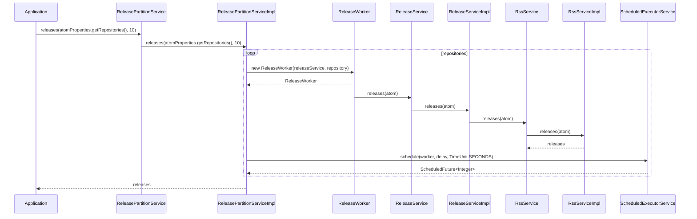

# releases-dashboard


[](https://sonarcloud.io/summary/new_code?id=rock-hu_releases-dashboard)    
[](https://sonarcloud.io/summary/new_code?id=rock-hu_releases-dashboard)     
[](https://sonarcloud.io/summary/new_code?id=rock-hu_releases-dashboard)      
[](https://sonarcloud.io/summary/new_code?id=rock-hu_releases-dashboard)    
[](https://sonarcloud.io/summary/new_code?id=rock-hu_releases-dashboard)        
[](https://sonarcloud.io/summary/new_code?id=rock-hu_releases-dashboard)       
[](https://sonarcloud.io/summary/new_code?id=rock-hu_releases-dashboard)       
[](https://sonarcloud.io/summary/new_code?id=rock-hu_releases-dashboard)      
[](https://sonarcloud.io/summary/new_code?id=rock-hu_releases-dashboard)        
[](https://sonarcloud.io/summary/new_code?id=rock-hu_releases-dashboard)       

| on push                                                                                                | on schedule                                                                                                   |
| ------------------------------------------------------------------------------------------------------ | ------------------------------------------------------------------------------------------------------------- |
|  |  |



```bash
releases-dashboard/docs$ find . -name 'README.md' > README.csv
```

## maven

```bash

mvn spotless:apply
mvn clean package -s settings.xml -Dspotless.check.skip=true -Dmaven.test.skip=true -Dmaven.test.failure.ignore=true
```

## docs

```bash
npm install -g markdownlint-cli
markdownlint 'docs/**/*.md' --ignore node_modules  --fix
```

## /orgs/{{organization}}/repos

`GET https://api.github.com/orgs/{{organization}}/repos?per_page=100&sort=full_name`

```groovy
// pm.environment.set("organization","spring-projects");
// pm.environment.set("organization","zalando");
// pm.environment.set("organization","square");
pm.environment.set("organization","openrewrite");
```

```groovy
const organizations = pm.response.json();
for (let i = 0; i < organizations.length; i++) {
    const repository = organizations[i];
    console.log('    - '+repository.html_url + '/releases.atom');
}
```

## openrewire

```bash
mvn rewrite:run
```

```bash
mvn -U org.openrewrite.maven:rewrite-maven-plugin:run -Drewrite.exportDatatables=true -Drewrite.recipeArtifactCoordinates=org.openrewrite.recipe:rewrite-java-dependencies:RELEASE -Drewrite.activeRecipes=org.openrewrite.java.dependencies.DependencyVulnerabilityCheck
```

